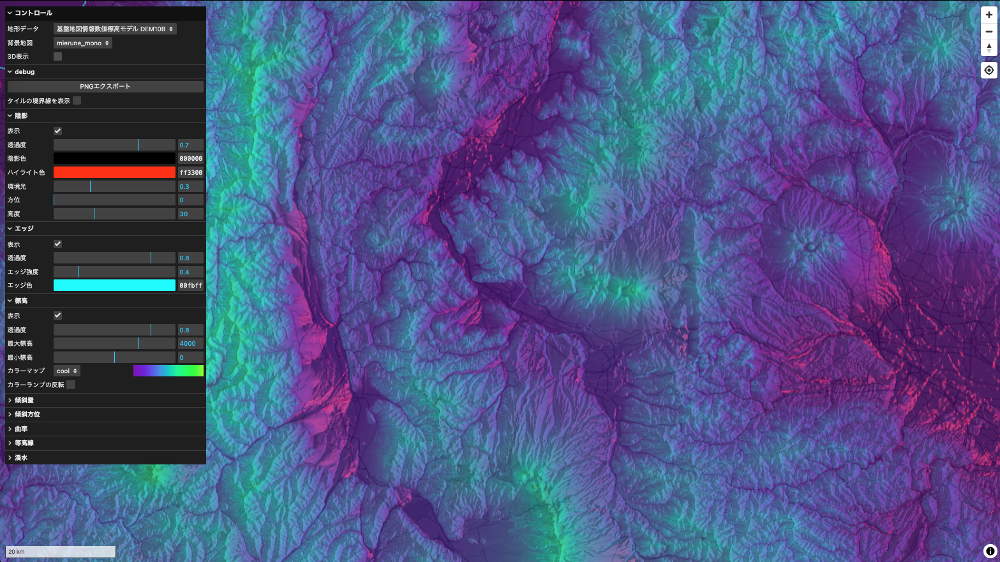

# Terrain Visualizer🏔️

An interactive application that visualizes terrain using elevation tiles.

)


## 概要

標高タイルからインタラクティブに地形を可視化するアプリケーションです。

※ このアプリケーションで可視化されたデータはあくまで視覚的なものであり、その正確性を保証するものではありません。

## データソース

- [国土地理院 地理院標高タイル](https://maps.gsi.go.jp/development/ichiran.html)
- [産総研 シームレス標高タイル](https://tiles.gsj.jp/tiles/elev/tiles.html#h_hyogo)
- [G 空間情報センター 栃木県「数値標高モデル(DEM)0.5m」](https://www.geospatial.jp/ckan/dataset/dem05_tochigi)
- [G 空間情報センター 高知県「数値標高モデル(DEM)0.5m」](https://www.geospatial.jp/ckan/dataset/dem05_kochi)
- [AWS Terrain Tiles](https://aws.amazon.com/marketplace/pp/prodview-x7vtai3hasf26#resources/)

## 開発環境

```
npm install
npm run dev
```
